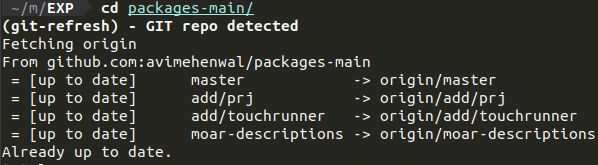

#### git-refresh

This is a clone of avimehenwal/git-refresh, which fixes an issue with the 'find' command when run on MacOS with the latest fish (V3.5.1).

> A plugin for [Oh My Fish][omf-link].

[](/LICENSE)
[](https://fishshell.com)
[](https://www.github.com/oh-my-fish/oh-my-fish)

<br/>

# Introduction

**git-refresh** automates pulling your git managed repositories
as soon as you `cd` into them.

No command, no fuss required. Just plain old-fashioned simple automation.

Hope it saves you some time and hopefully some frustration overtime.

Project aim is that you never see the following git error warning 

```
To https://github.com/USERNAME/REPOSITORY.git
  ! [rejected]        master -> master (non-fast-forward)
error: failed to push some refs to 'https://github.com/USERNAME/REPOSITORY.git'
To prevent you from losing history, non-fast-forward updates were rejected
Merge the remote changes (e.g. 'git pull') before pushing again.  See the
'Note about fast-forwards' section of 'git push --help' for details.
```

Hail Automation! :)

## Demo



## Install

```fish
$ fisher install PJC-64/git-refresh
```


## Usage

Upon successfull installation, just relax and let the
plugin take care of pulling git repo as soon as you
cd to any *git managed* directory.

It executes automatically. :relaxed:


# License

[MIT][mit] © [avimehenwal][author] et [al][contributors]


[mit]:            https://opensource.org/licenses/MIT
[author]:         https://github.com/avimehenwal
[contributors]:   https://github.com/avimehenwal/plugin-git-refresh/graphs/contributors
[omf-link]:       https://www.github.com/oh-my-fish/oh-my-fish

[license-badge]:  https://img.shields.io/badge/license-MIT-007EC7.svg?style=flat-square
